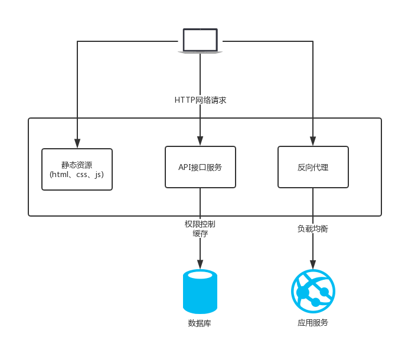
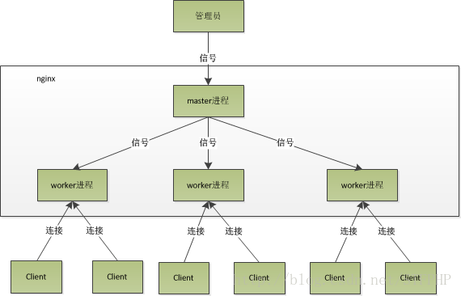
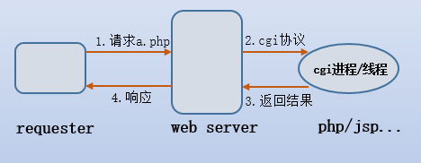

# 一、搭建 Nginx 运行环境

## 1.nginx 应用场景

- 静态资源服务器
- 反向代理服务
- API 接口服务
  

## 2.nginx 优势

- 高并发高性能
- 可扩展性好

* 高可靠性
* 热部署
* 开源许可证

## 3.学习环境

### 3.1 操作系统

[centos764 位](http://59.80.44.49/isoredirect.centos.org/centos/7/isos/x86_64/CentOS-7-x86_64-DVD-1810.iso)

### 3.2 环境确认

### 3.2.1 启用网卡

```sh
vi /etc/sysconfig/network-scripts/ifcfg-ens33ONBOOT=yes 是否随网络服务启动，ens33生效
```

### 3.2.2 关闭防火墙

| 功能           | 命令                                |
| -------------- | ----------------------------------- |
| 停止防火墙     | systemctl stop firewald.service     |
| 永久关闭防火墙 | systemctl disable firewalld.service |

### 3.2.3 确认停用 selinux

- 安全增强型 Linux(Security-Enhanced Linux)简称 SELinux,它是一个 Linux 内核模块，也是 Linux 的一个安全子系统。

- SELinux 主要作用就是最大限度地减少系统中服务进程可访问的资源（最小权限原则）。

| 功能     | 命令                                                               |
| -------- | ------------------------------------------------------------------ |
| 检查状态 | getenforce                                                         |
| 检查状态 | /usr/sbin/sestatus -v                                              |
| 临时关闭 | setenforce 0                                                       |
| 永久关闭 | /etc/serlinux/config SELINUX = `enforcing` 改为 SELINUX=`disabled` |

### 3.2.4 安装依赖模块

```
yum -y install gcc gcc-c++ autoconf pcre pcre-devel make automake
yum -y install wget httpd-tools vim
```

| 软件包      | 描述                                                                                                                                                                                                                                                                                                 |
| ----------- | ---------------------------------------------------------------------------------------------------------------------------------------------------------------------------------------------------------------------------------------------------------------------------------------------------- |
| gcc         | gcc 是指整个 gcc 的这一套工具集合，它分为 gcc 前端和 gcc 后端（我个人理解为 gcc 外壳和 gcc 引擎）,gcc 前端对应各种特定语言（如 c++/go 等）的处理（对 c++/go 等特定语言进行对应的语法检查，将 c++/go 等语言的代码转化为 c 代码等），gcc 后端对应把前端的 c 代码转为跟你的电脑硬件相关的汇编或机器码。 |
| gcc-c++     | 而就软件程序包而言，gcc.rpm 就是哪个 gcc 后端，而 gcc-c++.rmp 就是针对 c++这个特定语言的 gcc 前端。                                                                                                                                                                                                  |
| autoconf    | autoconf 是一个软件包，以适应多种 Unix 类系统的 shell 脚本的工具。                                                                                                                                                                                                                                   |
| pcre        | PCRE(Perl Compatible Regular Expressions)是一个 Perl 库，包括 perl 兼容的正则表达式库                                                                                                                                                                                                                |
| pcre-devel  | devel 包主要是供开发用，包含头文件和链接库                                                                                                                                                                                                                                                           |
| make        | 常指一条计算机指令，是在安装有 GNU Make 的计算机上得到可执行指令。该指令是读入一个名为 makefile 的文件，然后执行这个文件中指定的指令。                                                                                                                                                               |
| automake    | automake 可以用来帮助我们自动地生成符合自由软件惯例的 Makefile。                                                                                                                                                                                                                                     |
| wget        | wget 是一个从网络上自动下载文件的自由工具，支持通过 HTTP、HTTPS、FTP 三个最常见的 TCP/IP 协议下载，并可以使用 HTTP 代理。                                                                                                                                                                            |
| httpd-tools | apace 压力测试                                                                                                                                                                                                                                                                                       |
| vim         | Vim 是一个类似于 Vi 的著名的功能强大、高度可定制的文本编辑器。                                                                                                                                                                                                                                       |

| 目录名   | 描述                   |
| -------- | ---------------------- |
| app      | 存放代码和应用         |
| backup   | 存放备份的文件         |
| download | 下载下来的代码和安装包 |
| logs     | 放日志的               |
| work     | 工作目录               |

## 4.nginx 的架构

### 4.1 轻量

- 源代码只包含核心模块
- 其他非核心功能都是通过模块实现，可以自由选择

### 4.2 架构

- Nginx 采用的是多进程（单线程）和多路 IO 复用模型

### 4.2.1 工作流程

1.Nginx 在启动后，会有一个`master` 进程和多个相互独立的`worker`进程。

2.接收来自外界的信号，向各`worker`进程发送信号，每个进程都有可能来处理这个连接。

3.master 进程能监控 worker 进程的运行状态，当 worker 进程退出后（异常情况下），会自动启动新的 worker 进程。


- worker 进程数，一般会设置成机器 cpu 核数。因为更多的 worker 数，只会导致进程相互竞争 cpu，从而带来不必要的上下文切换。
- 使用多进程模式，不仅能提高并发率，而且进程之间相互独立，一个 worker 进程挂了不会影响到其他 worker 进程。

### 4.2.2 IO 多路复用

- 多个文件描述符的 IO 操作都能在一个线程里并发交替顺序完成，复用线程。
  

### 4.2.3 CPU 亲和

- 把 CPU 内核和 nginx 的工作进程绑定在一起，让每个 worker 进程固定在一个 CPU 上执行，从而减少 CPU 的切换并提高缓存命中率，提高 性能

### 4.2.4 sendfile

- sendfile 零拷贝传输模式

  

## 5.nginx 安装

### 5.1 版本分类

- Mainiline version 开发版
- Stable version 稳定版
- Legacy versions 历史版本

### 5.2 下载地址

[nginx](http://nginx.org/en/download.html)
[linux_packages](http://nginx.org/en/linux_packages.html#stable)

### 5.3 CentOS 下 YUM 安装

vi/etc/yum.repos.d/nginx.repo

```sh
[nginx]
name=nginx repo
baseurl=http://nginx.org/packages/centos/7/$basearch/
gpgcheck=0
enabled=1
```

```sh
yum install nginx -y 安装nginx
nginx -v 查看安装的版本
nginx -V 查看编译时的参数
```

## 6.目录

### 6.1 安装目录

查看 nginx 安装的配置文件和目录

```sh
rpm -ql nginx
```

### 6.2 日志切割文件

/etc/logrotate.d/nginx

- 对访问日志进行切割

```sh
/var/log/nginx/*.log{
    daily
}
```

```sh
ls /var/log/nginx/*.log
/var/log/nginx/access.log /var/log/nginx/error.log
```

### 6.3 主配置文件

| 路径                           | 用途                     |
| ------------------------------ | ------------------------ |
| /etc/nginx/nginx.conf          | 核心配置文件             |
| /etc/nginx/conf.d/default.conf | 默认 http 服务器配置文件 |

### 6.4cgi 配置

- CGI 是 common gateway interface(通用网关接口)
- Web Server 通过 cgi 协议可以把动态的请求传递给如 php、jsp、python 和 perl 等应用程式。
- FastCGI 实际是增加了一些扩展功能的 CGI，是 CGI 的改进，描述了客户端和 Web 服务器程序之间传输数据的一种标准。
- SCGI 协议是一个 CGI（通用网关接口） 协议的替代品，它是一个应用与 HTTP 服务器的接口标准，类似于 FastCGI，但是它设计得更为容易实现。
- uwsgi 是一个 Web 服务器，它实现了 WSGI 协议、uwsgi、http 等协议。
  

| 路径                      | 用途         |
| ------------------------- | ------------ |
| /etc/nginx/fastcgi_params | fastcgi 配置 |
| /etc/nginx/scgi_params    | scgi 配置    |
| /etc/nginx/uwsgi_params   | uwsgi 配置   |

### 6.5 编码转换映射转化文件

- 这三个文件都是与编码转换映射文件，用于在输出内容到客户端是，将一种编码转换到另一种编码
- `koi8-r`是斯拉夫文字 8 位元编码，供俄语及保加利亚语使用。在 Unicode 未流行之前，KOI8-R 是最为广泛使用的俄语编码，使用率甚至比 ISO/IEC 8859-5 还高。这 3 个文件存在是因为作者是俄国人的原因。

| 路径               | 用途                   |
| ------------------ | ---------------------- |
| /etc/nginx/koi-utf | koi8-r<-->utf-8        |
| /etc/nginx/koi-win | koi8-r<-->windows-1251 |
| /etc/nginx/win-utf | windows-125<-->utf-8   |

### 6.6 扩展文件

/etc/nginx/mime.types

| 路径     | 用途                                                                    |
| -------- | ----------------------------------------------------------------------- |
| 配置文件 | /etc/nginx/mime.types // 设置 http 协议的 Content-Type 与扩展名对应关系 |

### 6.7 守护进程管理

| 用于配置系统守护进程管理方式路径            | 用途 |
| ------------------------------------------- | ---- |
| /usr/lib/systemd/system/nginx-debug.service | --   |
| /usr/lib/systemd/system/nginx.service       | ---  |
| /etc/sysconfig/nginx                        | --   |
| /etc/sysconfig/nginx-debug                  | ---  |

```sh
systemctl restart nginx.service
```

### 6.8nginx 模块目录

- nginx 安装的模块

| 路径               | 用途                     |
| ------------------ | ------------------------ |
| /etc/nginx/modules | 最基本的共享库和内核模块 |

目的是存放用于启动系统和执行 root 文件系统的命令，如`/bin`和`/sbin`的二进制文件的共享库，或者存放 32 位，或者 64 位（file 命令查看）||/usr/lib64/nginx/modules|64 位共享库

### 6.9 文档

- nginx 的手册和帮助文件

| 路径                                  | 用途     |
| ------------------------------------- | -------- |
| /usr/share/doc/nginx-1.14.2           | 帮助文档 |
| /usr/share/doc/nginx-1.14.0/COPYRIGHT | 版权声明 |
| /usr/share/man/man8/nginx.8.gz        | 手册     |

### 6.10 缓存目录

| 路径             | 用途             |
| ---------------- | ---------------- |
| /var/cache/nginx | nginx 的缓存目录 |

### 6.11 日志目录

| 路径           | 用途             |
| -------------- | ---------------- |
| /var/log/nginx | nginx 的日志目录 |

### 6.12 可执行命令

- nginx 服务的启动管理的可执行文件

| 路径                  | 用途               |
| --------------------- | ------------------ |
| /usr/sbin/nignx       | 可执行命令         |
| /usr/sbin/nginx-debug | 调试执行科执行命令 |

## 7.日志类型

### 7.1 日志类型

- access.log 访问日志
- error.log 错误日志

### 7.2 log_format

| 类型    | 用法                                          |
| ------- | --------------------------------------------- |
| 语法    | log_format name [escape=default[json] string] |
| 默认    | log_format combined ...                       |
| Contenx | http                                          |

案列

```sh
 log_format  main  '$remote_addr - $remote_user [$time_local] "$request" '
                      '$status $body_bytes_sent "$http_referer" '
                      '"$http_user_agent" "$http_x_forwarded_for"';

 log_format  zfpx  '$arg_name $http_referer sent_http_date"';
 access_log  /var/log/nginx/access.log  main;

 221.216.143.110 - - [09/Jun/2018:22:41:18 +0800] "GET / HTTP/1.1" 200 612 "-" "Mozilla/5.0 (Windows NT 6.1; Win64; x64) AppleWebKit/537.36 (KHTML, like Gecko) Chrome/62.0.3202.94 Safari/537.36" "-"
```

### 7.3 HTTP 请求变量

| 名称             | 含义     | 例子             |
| ---------------- | -------- | ---------------- |
| arg_PARAMETER    | 请求参数 | \$arg_name       |
| http_HEADER      | 请求头   | \$http_referer   |
| sent_http_HEADER | 响应头   | sent_http_cookie |

### 7.4 内置变量

[ngx_http_log_module log_format](http://nginx.org/en/docs/http/ngx_http_log_module.html#log_format)

| 名称              | 含义                                          |
| ----------------- | --------------------------------------------- |
| \$remote_addr     | 客户端地址                                    |
| \$remote_user     | 客户端用户名称                                |
| \$time_local      | 访问时间和时区                                |
| \$request         | 请求的 URI 和 HTTP 协议                       |
| \$http_host       | 请求地址，即浏览器中你输入的地址（IP 或域名） |
| \$status          | HTTP 请求状态                                 |
| \$body_bytes_sent | 发送给客户端文件内容大小                      |

## 8.nginx 实战

### 8.1 静态资源 Web 服务

- 静态资源：一般客户端发送请求到 web 服务器，web 服务器从内存中取到相应的文件，返回给客户端，客户端解析并渲染显示出来。
- 动态资源：一般客户端请求的动态资源，先将请求交于 web 容器，web 容器连接数据库，数据库处理数据之后，将内容交给 web 服务器，web 服务器返回给客户端解析渲染处理。

| 类型       | 种类           |
| ---------- | -------------- |
| 浏览器渲染 | HTML、CSS、JS  |
| 图片       | JPEG、GIF、PNG |
| 视频       | FLV、MPEG      |
| 下载文件   | Word、Excel    |

### 8.2 CDN

- CDN 的全称是 Content Delivery Network，即内容分发网络。
- CDN 系统能够实时地根据网络流量和各节点的连接、负载状况以及用户的距离和响应时间等综合信息将用户的请求重新导向离用户最近的服务节点上。其目的是使用户可就近取得所需的内容，解决 Internet 网络拥挤的状况，提高用户访问网站的响应速度。

#### 8.2.1

##### 8.2.1.1 sendfile

不经过用户内核发送文件

| 类型   | 种类                                |
| ------ | ----------------------------------- |
| 语法   | sendfile on/off                     |
| 默认   | sendfile off                        |
| 上下文 | http,server,location,if in location |

##### 8.2.1.2 tcp_nopush

在 sendfile 开启的请求下，提高网络包的传输效率

类型|种类
语法| tcp_nopush on / off
默认|tcp_nopush off
上下文|http,server,location

##### 8.2.1.3 tcp_nodelay

在 keepalive 连接下，提高网络包的传输实时性

| 类型   | 种类                |
| ------ | ------------------- |
| 语法   | tcp_nodelay on /off |
| 默认   | tcp_nodelay on      |
| 上下文 | http,serer,location |

##### 8.2.1.4 gzip

压缩文件可以节约宽带和提高网络传输效率

类型|种类
语法|gzip on /off
默认|gzip off
上下文| http,server,location

#### 8.2.1.5 gzip_http_version

压缩 HTTP 版本

| 类型   | 种类                      |
| ------ | ------------------------- |
| 语法   | gzip_http_version 1.0/1.1 |
| 默认   | gzip_http_version 1.1     |
| 上下文 | http,server,location      |

#### 8.2.1.6 http_gzip-static_module

现在磁盘上找同名的`.gz`这个文件是否存在，节约 CPU 的压缩时间和性能损耗

| 类型   | 种类                 |
| ------ | -------------------- |
| 语法   | gzip_static on/off   |
| 默认   | gzip_static off      |
| 上下文 | http,server,location |

```sh
location ~ .*\.(jpg|png|gif)$ {
    gzip off;
    gzip_http_version 1.1;
    gzip_comp_level 3;
    gzip_types image/jpeg image/png image/gif;
    root /data/images;
}

location ~ .*\.(html|js|css)$ {
    gzip on;
    gzip_min_length 1k;
    gzip_http_version 1.1;
    gzip_comp_level 9;
    gzip_types  text/css application/javascript;
    root /data/html;
}

location ~ ^/download {
    gzip_static on;
    tcp_nopush on;
    root /data/download;
}
```

### 8.3 浏览器缓存

校验本地缓存是否过期

| 类型          | 种类                           |
| ------------- | ------------------------------ |
| 检验是否过期  | Expires,Cache-Control(max-age) |
| Etag          | Etag                           |
| Last-Modified | Last-Modified                  |

#### 8.3.1 expires

添加 Cache-Control、Expires 头

| 类型   | 种类                 |
| ------ | -------------------- |
| 语法   | expires time         |
| 默认   | expires off          |
| 上下文 | http,server,location |

```sh
location ~ .*\.(jpg|png|gif)$ {
        expires 24h;
}
```

#### 8.4 跨域

| 类型   | 种类                  |
| ------ | --------------------- |
| 语法   | add_header name value |
| 默认   | add_header --         |
| 上下文 | http,server,location  |

```sh
location ~ .*\.json$ {
    add_header Access-Control-Allow-Origin http://localhost:3000;
    add_header Access-Control-Allow-Methods GET,POST,PUT,DELETE,OPTIONS;
    root /data/json;
}
```

```js
let xhr = new XMLHttpRequest()
xhr.open("GET", "http://47.104.184.134/users.json", true)
xhr.onreadystatechange = function() {
  if (xhr.readyState == 4 && xhr.status == 200) {
    console.log(xhr.responseText)
  }
}
xhr.send()
```
